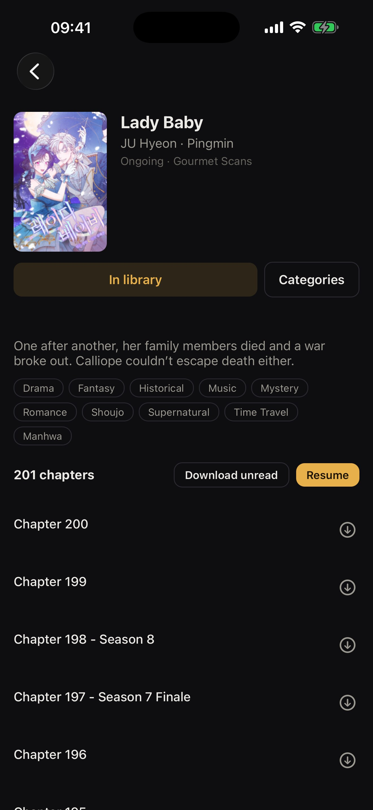
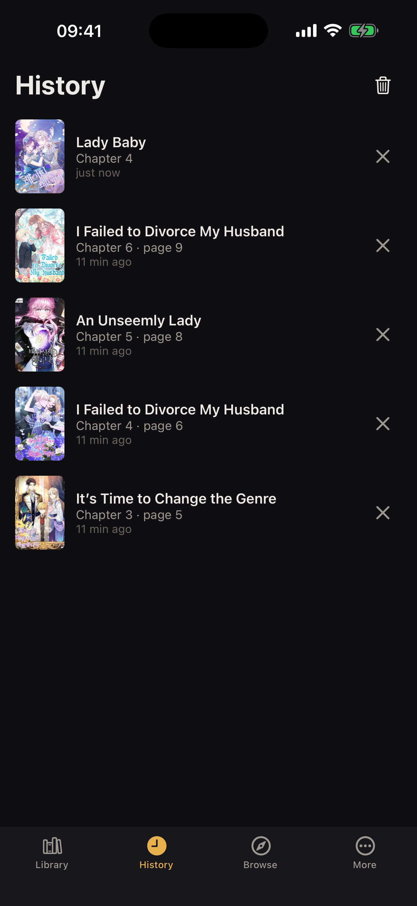

# Kanso

A manga reader for iOS and Android modelled on [Mihon](https://github.com/mihonapp/mihon), which runs
Mihon's own extension ecosystem. Kotlin extensions from
[keiyoushi/extensions-source](https://github.com/keiyoushi/extensions-source) are translated
mechanically into JavaScript bundles, which the app downloads from a repository and runs.

<p>
  
  
  
  
</p>

## Install

Each [release](https://github.com/Rhombicdodecahedron/kanso/releases/latest) has:

- **Android:** `kanso-<version>.apk`. Download it and open it to install.
- **iPhone / iPad:** add this source in [AltStore](https://altstore.io) or [SideStore](https://sidestore.io), which also installs updates:

  ```
  https://github.com/Rhombicdodecahedron/kanso/releases/latest/download/altstore.json
  ```

  Or sideload `kanso-<version>.ipa` with [Sideloadly](https://sideloadly.io).

## Layout

| Path | What |
|---|---|
| `packages/source-api` | Runtime that translated extensions run against: Kotlin stdlib and coroutines, Jsoup (parse5 + css-select), OkHttp (async interceptors), kotlinx.serialization (JSON, Protobuf), java.time/text, crypto, keiyoushi `core`, Mihon's model and `KeiSource`. `host.ts` is the API the app uses. |
| `packages/translator` | Kotlin → JS compiler (tree-sitter-kotlin) plus a CLI that translates the whole repo and writes bundles, `index.min.json` and a compatibility report. |
| `packages/harness` | Runs bundles against live sites (popular → details → pages → image). Also a dev server for a repo. |
| `apps/reader` | Expo / React Native app (library, history, browse, extensions, reader, downloads). |
| `docs/runtime-conventions.md` | How translated code and the runtime agree on representations. |

## Translating extensions

```bash
git clone --depth 1 https://github.com/keiyoushi/extensions-source ../extensions-source
cd packages/translator
npx tsx src/cli.ts --src ../../../extensions-source --out ../../repo
cat ../../repo/report.md        # what translated, top reasons for what didn't
```

The translator is deterministic. An extension either translates completely or is rejected with a
reason, such as an unsupported Kotlin construct or a runtime API that isn't implemented yet. The
report ranks those reasons, which shows what to implement next.

## Testing against live sites

```bash
cd packages/harness
npx tsx src/cli.ts ../../repo/eu.kanade.tachiyomi.extension.en.gourmetscans.js
npx tsx src/batch.ts --theme madara --limit 100     # writes repo/harness.json
```

## Running the app

```bash
cd packages/harness && npx tsx src/serve.ts ../../repo 8787   # serve the repo (+ /log for dev)
cd apps/reader && npx expo run:ios                             # dev build on a simulator
```

In the app, go to Browse → Extensions → Repos and add `http://127.0.0.1:8787` (the simulator
shares the host's network). In dev builds the Library screen polls `repo/debug.json`. Writing
`{"id":"x1","route":"/browse"}` there opens that screen. Writing
`{"id":"x2","pkg":"<extension pkg>"}` runs install → popular → details → pages → image inside the
app and reports each step to `repo/device.log`.

## Checks

```bash
npm test --workspaces --if-present
cd apps/reader && npx tsc --noEmit && npx expo lint
```

## Licence notes

Mihon and keiyoushi/extensions-source are Apache-2.0. Translated bundles are derivative works of
those extensions. See `NOTICE`. Kanso is not affiliated with Mihon.
